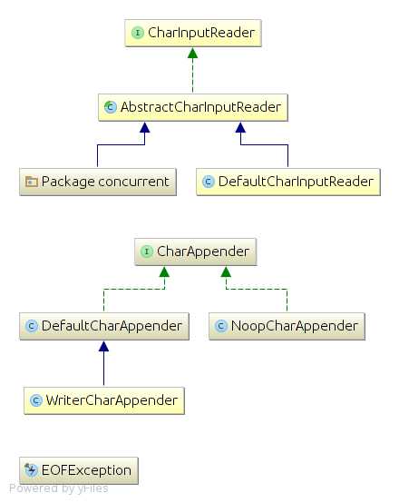

A powerful CSV/TSV/Fixed-width file parser library uniVocity-parsers in Java
======

The open-source project uniVocity-parsers is a CSV/TSV/Fixed-width file parser library in Java, providing
the capability to read/write files with simplified API, and powerful features as shown below.

Unlike other libraries out there, the uniVocity-parsers build it's own architecture for parsing text files, which
focus on maximum performance and flexibility while making it easy to extend for new parsers.

###Contents###

* [Overview](#1-overview)
* [Installation](#2-installation)
* [Features Overview](#3-features-overview)
* [Reading CSV/TSV/Fixed-width Files](#4-features-in-reading-tabular-presentations-data)
* [Writing CSV/TSV/Fixed-width Files](#5-features-in-writing-tabular-presentations-data)
* [Performance](#6-performance-and-flexibility)
* [Design and Implementations](#7-design-and-implementations)

### 1. Overview


The project uniVocity-parsers was started by [uniVocity Software](http://www.univocity.com/) during the
development of uniVocity, a commercial data integration API for Java. It mainly focus on
flexibility, performance, and reliability in tabular representation data parsing.
[Commercial supports](support@univocity.com) is also provided for building new parsers.

The project is hosted at [Github](https://github.com/uniVocity/univocity-parsers) with 60 starts & 7 forks.
Tremendous document and tutorial are provided at [here](http://www.univocity.com/pages/parsers-tutorial)
and [here](http://www.univocity.com/pages/parsers-features).
You can find more examples and news [here](http://www.univocity.com/blogs/news) also.

__The well-known open-source project Apache Camel integrates uniVocity-parsers for reading and writing CSV/TSV/Fixed-width files.
Find more details [here](http://camel.apache.org/univocity-parsers-formats.html).__

### 2. Installation
Install the parser library in the following 2 ways as you prefer:
* Directly download the jar [here](http://oss.sonatype.org/content/repositories/releases/com/univocity/univocity-parsers/1.5.1/univocity-parsers-1.5.1.jar).
* Simply add the following to your `pom.xml` if you are using Maven:

```xml
<dependency>
    <groupId>com.univocity</groupId>
    <artifactId>univocity-parsers</artifactId>
    <version>1.5.1</version>
    <type>jar</type>
</dependency>
```

### 3. Features Overview
uniVocity-parsers provides a list of powerful features, which could fulfill the requirements well in processing
tabular presentations data. Check the following overview chart for the features:


### 4. Features in Reading Tabular Presentations Data

### 5. Features in Writing Tabular Presentations Data

### 6. Performance and Flexibility

Here are some [Comparison tables in performance for all CSV parsers libraries in existence](https://github.com/uniVocity/csv-parsers-comparison#csv-parsers)
And you can find that the uniVocity-parsers got significant ahead of other libraries in performance.

The uniVocity-parsers achieved its purpose in performance and flexibility with the following mechanisms:

* __Read input on separate thread (enable by invoking `CsvParserSettings.setReadInputOnSeparateThread()`)__

> When enabled, a reading thread (in `input.concurrent.ConcurrentCharInputReader`) will be started and load characters from the input,
> while the parser is processing its input buffer. This yields better performance, especially when reading from big input (greater than 100 mb)
>
> When disabled, the parsing process will briefly pause so the buffer can be replenished every time
> it is exhausted (in `DefaultCharInputReader` it is not as bad or slow as it sounds, and can even be (slightly) more efficient if your input is small)

* __Caching during reading and writing (set buffer size by invoking `CsvParserSettings.setInputBufferSize()`)__

> For concurrency reading with `input.concurrent.ConcurrentCharInputReader`, the size of "bucket" and quantity of "buckets"
> are specified to for the cache pool. The `ConcurrentCharInputReader` will load "buckets" of characters in a separate thread
> and provides them sequentially to the buffer defined by instance of  `CharBucket`.
>
> For sequential reading, input reader `DefaultCharInputReader` owns buffer with array of characters with initial size 1024 * 1024 bytes.

* __Concurrent row processor__

> As an entry to process rows of data, the `ConcurrentRowProcessor` implements `RowProcessor` to perform row processing tasks in parallel.
> It wraps another `RowProcessor` and collects rows read from the input. The actual row processing is performed in by wrapped RowProcessor in a separate thread.
>
> The row processing task is submitted to the thread pool implemented with `java.util.concurrent` package.
> The thread pool is initialized with `new Executors.FinalizableDelegatedExecutorService(new ThreadPoolExecutor(1, 1, 0L, TimeUnit.MILLISECONDS, new LinkedBlockingQueue()));`

* __Extend `RowProcessor` to read rows with your own business logic)__

```java
CsvParserSettings settings = new CsvParserSettings();

settings.setRowProcessor(new RowProcessor() {

    /**
    * preprocess the row with your own business logic
    **/
    @Override
    public void processStarted(ParsingContext context) {
        System.out.println("Started to process rows of data.");
    }

    /**
    * process the row with your own business logic
    **/
    @Override
    public void rowProcessed(String[] row, ParsingContext context) {
        System.out.println("The row in line #" + context.currentLine() + ": ");
        StringBuffer stringBuffer = new StringBuffer();
        for (String col : row) {
            stringBuffer.append(col).append("\t");
        }
        System.out.println(stringBuffer);
    }

    /**
    * post-process the row with your own business logic
    **/
    @Override
    public void processEnded(ParsingContext context) {
        System.out.println("Finished processing rows of data.");
    }
});

CsvParser parser = new CsvParser(settings);
List<String[]> allRows = parser.parseAll(new FileReader("/examples/example.csv"));
```

* __Extend `RowProcessor` to write rows with your own business logic__

```java
// setup the settings for witting rows
StringWriter strWriter = new StringWriter();
CsvWriterSettings settings = new CsvWriterSettings();

// set the instance of `TestBean` as the bean for rows
settings.setRowWriterProcessor(new BeanWriterProcessor<TestBean>(TestBean.class));
CsvWriter writer = new CsvWriter(strWriter, settings);

// write the row headers
writer.writeHeaders("Year", "Model", "Description", "Price");

// write the column values in current row
Collection<Object[]> rows = new ArrayList<Object[]>();
rows.add(new String[]{"2015", "Inspiron 1420", "DELL laptop", "4000"});
rows.add(new String[]{"2014", "iPhone 5s", "The best phone ever", "4000"});

// write rows of data and close the I/O to finish
writer.commentRow("This is a comment");
writer.writeRowsAndClose(rows);
```

* __Extend `ColumnProcessor` to process columns with your own business logic__

### 7. Design and Implementations
* The bunch of processors in uniVocity-parsers are core modules, which are responsible for reading/writing data in
rows and columns, and data conversions.
Here is the diagram of processors:


According to the above diagram, you can creates your own processors easily by implementing according interfaces.

* The different type of input readers in uniVocity-parsers provide concurrent reading, characters caching and flexibility
for different format of data.
Here is the diagram of input readers:

