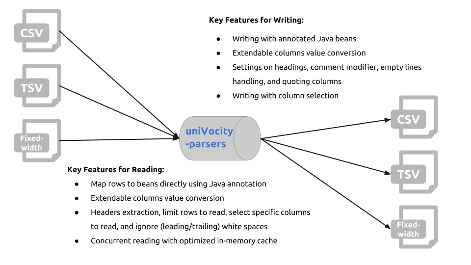

A powerful CSV/TSV/Fixed-width file parser library uniVocity-parsers in Java
======

The open-source project uniVocity-parsers is a CSV/TSV/Fixed-width file parser library in Java, providing
the capability to read/write files with simplified API, and powerful features as shown below.

Unlike other libraries out there, the uniVocity-parsers build it's own architecture for parsing text files, which
focus on maximum performance and flexibility while making it easy to extend for new parsers.

###Contents###

1. Overview
2. Installation
3. Reading CSV/TSV/Fixed-width Files
4. Writing CSV/TSV/Fixed-width Files
5. Performance
6. Design and Implementations

### 1. Overview


The project uniVocity-parsers was started by [uniVocity Software](http://www.univocity.com/) during the
development of uniVocity, a commercial data integration API for Java. It mainly focus on
flexibility, performance, and reliability in tabular representation data parsing.
[Commercial supports](support@univocity.com) is also provided for building new parsers.

The project is hosted at [Github](https://github.com/uniVocity/univocity-parsers) with 60 starts & 7 forks.
Tremendous document and tutorial are provided at [here](http://www.univocity.com/pages/parsers-tutorial)
and [here](http://www.univocity.com/pages/parsers-features).
You can find more examples and news [here](http://www.univocity.com/blogs/news) also.

__The well-known open-source project Apache Camel integrates uniVocity-parsers for reading and writing CSV/TSV/Fixed-width files.
Find more details [here](http://camel.apache.org/univocity-parsers-formats.html).__

### 2. Installation

1. Directly download the jar [here](http://oss.sonatype.org/content/repositories/releases/com/univocity/univocity-parsers/1.5.1/univocity-parsers-1.5.1.jar).
2. Simply add the following to your `pom.xml` if you are using Maven:

```xml
<dependency>
    <groupId>com.univocity</groupId>
    <artifactId>univocity-parsers</artifactId>
    <version>1.5.1</version>
    <type>jar</type>
</dependency>
```

### 3. Features of uniVocity-parsers
#### 3.1 Overview


#### 3.2 Reading

#### 3.3 Writing

### 4. Performance


### 5. Design and Implementations

